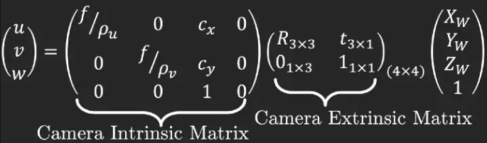
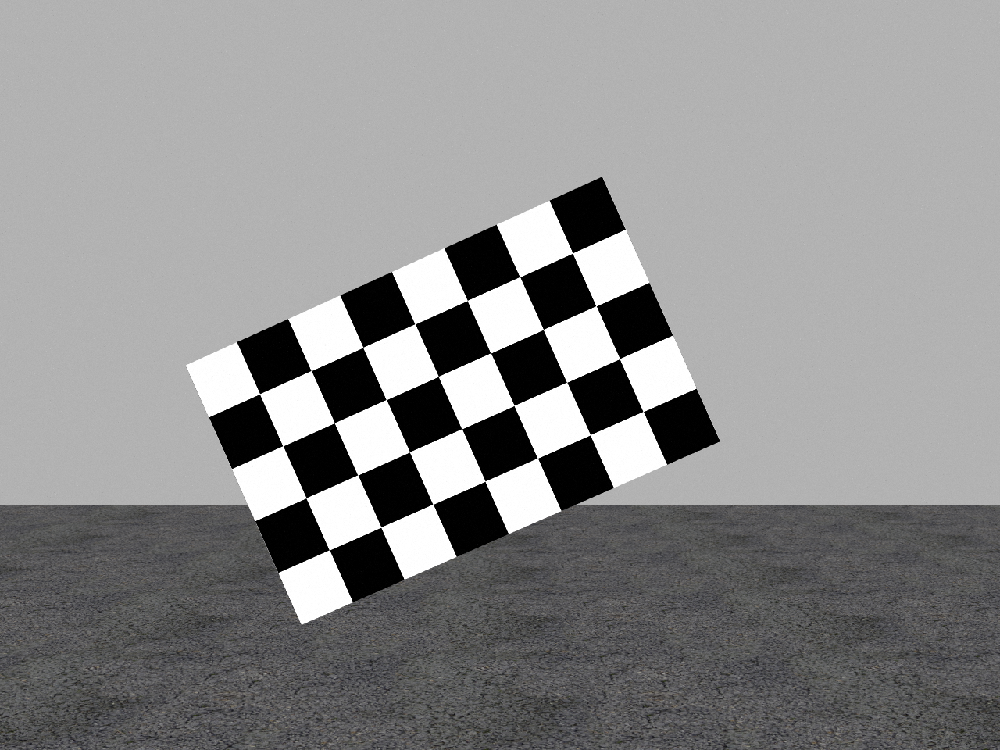
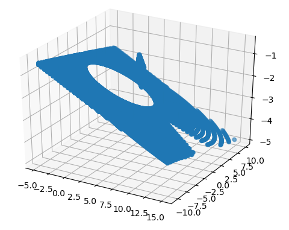
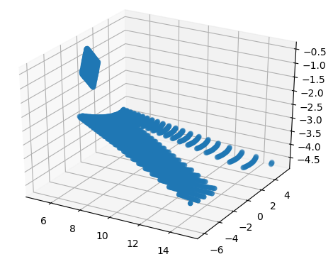
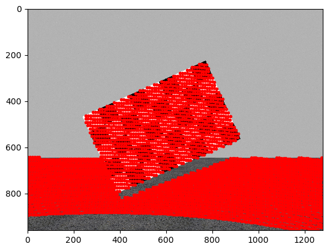
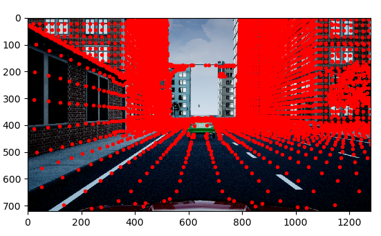
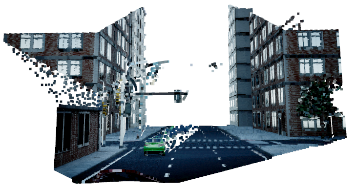

# Simple lidar camera sensor fusion 

This code repo is mainly to demystify MATLAB function [projectLidarPointsOnImage](https://www.mathworks.com/help/lidar/ref/projectlidarpointsonimage.html) and [fuseCameraToLidar](https://www.mathworks.com/help/lidar/ref/fusecameratolidar.html) 
using MATLAB data (camera instrics, extrinsics, image and pcd data) to achieve the exact results. The 
mathmatical theory can be found in this [post](https://towardsdatascience.com/what-are-intrinsic-and-extrinsic-camera-parameters-in-computer-vision-7071b72fb8ec). 

## Math theory

Given a pinhole camera model (camera instrinsics), a 3d world can be mapped onto a 2d camera image plane with 

where [Xw,Yw,Zw] denotes a point in this coordinate system, and [u, v, w] represent the indices (w==1) of this point when projected onto the camera image plane.
Due to the size of camera field of view (FOV), not all points will be mapped onto the image plane, thus we can track the indices of lidar points which have valid indices 
after the camera model tranformation. 

## Results
### project lidar points onto image
We start with projection of lidar point cloud on to a checkerboard, which would make it straighforward to see whether the project is correct or not. The detailed implementation can be found in projectLidar2Camera, which also returns the indices of lidar points that has captured by camera. 

### fuse camer image with 3d lidar point cloud in python
Once we are able to project lidars onto image plane, then it is trivial to fuse
image's RBG infomation with 3d lidar point cloud, by assigning the BRG values to at [u,v] on the image to 3d lidar points that fall in [u,v] pixel with Open3d.

## Requirements
- Open3d 
- python-pcl  (can be installed with pip install python-pcl)

